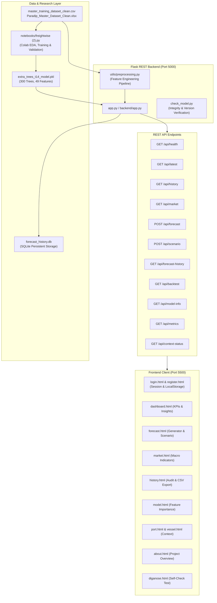

# FreightWise AI — Intelligent Freight Forecasting & Decision Support System

> **SIH Problem Code:** SIH26006 — Intelligent Freight Forecasting Model  
> **Target Domain:** Bulk Cargo Procurement & Vessel Chartering for the East Coast of India (Paradip Port & Hinterland)  
> **Core Target:** `bdry_close` (Breakwave Dry Bulk Shipping ETF closing price as a freight-market proxy)  
> **Primary Forecast Horizon:** $t+14$ future available trading observations (~14 business days)  
> **Champion Model:** Extra Trees Regressor (300 estimators) trained on 49 leakage-safe features  

---

## Table of Contents

1. [Executive Summary & Project Purpose](#1-executive-summary--project-purpose)
2. [High-Level Architecture](#2-high-level-architecture)
3. [Repository Directory & File Structure](#3-repository-directory--file-structure)
4. [Data Pipeline & Feature Engineering Logic](#4-data-pipeline--feature-engineering-logic)
   - [Target Variable & Dataset Scope](#target-variable--dataset-scope)
   - [Engineered Feature Groups (49 Features)](#engineered-feature-groups-49-features)
   - [Data Leakage Prevention Mechanisms](#data-leakage-prevention-mechanisms)
   - [Chronological Data Splitting Strategy](#chronological-data-splitting-strategy)
5. [Machine Learning Models, Experiments & Benchmarks](#5-machine-learning-models-experiments--benchmarks)
   - [Evaluated Regressors & Hyperparameters](#evaluated-regressors--hyperparameters)
   - [Evaluation Metrics Formulation](#evaluation-metrics-formulation)
   - [Benchmark Results & Model Ranking](#benchmark-results--model-ranking)
   - [Walk-Forward Chronological Stability Check](#walk-forward-chronological-stability-check)
   - [Baseline Benchmark: Naive Persistence vs. ML](#baseline-benchmark-naive-persistence-vs-ml)
   - [Feature Importance & Key Market Drivers](#feature-importance--key-market-drivers)
6. [Backend Architecture & Code Logic](#6-backend-architecture--code-logic)
   - [Server Initialization & State Management](#server-initialization--state-management)
   - [REST API Endpoint Reference](#rest-api-endpoint-reference)
   - [What-If Scenario Simulation Logic](#what-if-scenario-simulation-logic)
   - [SQLite Forecast History Database](#sqlite-forecast-history-database)
   - [Utility Modules (`preprocessing.py`, `check_model.py`)](#utility-modules-preprocessingpy-check_modelpy)
7. [Frontend Architecture & Client-Side Logic](#7-frontend-architecture--client-side-logic)
   - [Design System & Glassmorphic UI](#design-system--glassmorphic-ui)
   - [Authentication & Session Flow](#authentication--session-flow)
   - [Page Explanations & Component Behaviors](#page-explanations--component-behaviors)
   - [Visualization Engine (Chart.js Integration)](#visualization-engine-chartjs-integration)
   - [Diagnostic Suite (`diganose.html` / `diganose.js`)](#diagnostic-suite-diganosehtml--diganosejs)
8. [Installation, Environment Setup & Execution](#8-installation-environment-setup--execution)
9. [Candid Operational Takeaways & Limitations](#9-candid-operational-takeaways--limitations)

---

## 1. Executive Summary & Project Purpose

Freight rates in maritime shipping are notoriously volatile, subject to complex interplays of global economic momentum, regional industrial demand, weather disruptions, port congestion, and vessel fleet positioning. For procurement and chartering teams sourcing dry-bulk commodities (such as coking coal, thermal coal, and iron ore) bound for major ports along the East Coast of India (such as Paradip Port), inaccurate rate expectations lead to costly contract mispricings and demurrage penalties.

**FreightWise AI** provides an end-to-end forecasting and decision-support platform designed to replace guesswork with empirical predictive modeling. 

### Core Capabilities:
- **$t+14$ Forecast Generation:** Predicts dry-bulk freight movement 14 trading observations into the future using an ensemble Extra Trees regressor.
- **Leakage-Safe Feature Processing:** Builds 49 statistical, lag, calendar, and macroeconomic features strictly using information available prior to the forecast origin date.
- **Tree Spread Analysis:** Computes standard deviations and 10th-to-90th percentiles across the model's 300 decision trees to provide transparent uncertainty bounds.
- **Interactive What-If Scenarios:** Allows chartering officers to perturb specific market inputs (e.g., coal import volumes, energy demand) and observe simulated model responses.
- **Out-of-Sample Historical Auditing:** Provides full transparency by comparing predictions against real historical outcomes and testing against a naive persistence baseline.
- **Honest Context Reporting:** Clearly indicates disconnected data streams (e.g., live port berth congestion, AIS vessel telemetry, marine weather) rather than fabricating dummy values.

---

## 2. High-Level Architecture

The system operates across three primary layers: **ML Research & Preprocessing**, **Flask Micro-Service Backend**, and a **Vanilla Web UI**.



---

## 3. Repository Directory & File Structure

```text
FreightWiseAI/
│
├── README.md                                  # Comprehensive project documentation
├── FreightWiseAI.zip                          # Compressed project archive for distribution
│
└── FreightWiseAI/                             # Main application workspace
    ├── .vscode/
    │   └── settings.json                      # VS Code workspace Python environment settings
    ├── app.py                                 # Root convenience alias for backend/app.py
    │
    ├── backend/                               # Python Flask API & Machine Learning engine
    │   ├── app.py                             # Core Flask REST server, routes & logic
    │   ├── app_old.py                         # Earlier backup/iteration of app.py
    │   ├── check_model.py                     # CLI verification tool for model & data sync
    │   ├── requirements.txt                   # Pinned Python package dependencies
    │   │
    │   ├── data/                              # Datasets, reference metrics, and databases
    │   │   ├── master_training_dataset_clean.csv   # Primary time-series dataset (daily rows)
    │   │   ├── Paradip_Master_Dataset_Clean.xlsx  # Multi-sheet Excel dataset for Paradip Port
    │   │   ├── forecast_history.db            # SQLite database storing generated forecasts
    │   │   ├── final_model_summary.csv        # Metrics summary for the final Extra Trees model
    │   │   ├── model_comparison_t14.csv       # Comparison table of all 7 evaluated ML models
    │   │   └── reference/                     # Training reference artifacts & benchmark outputs
    │   │       ├── extra_trees_t14_feature_list.csv
    │   │       ├── extra_trees_t14_future_forecast.csv
    │   │       ├── extra_trees_t14_test_predictions.csv
    │   │       ├── final_model_summary.csv
    │   │       └── model_comparison_t14.csv
    │   │
    │   ├── model/                             # Serialized machine learning models
    │   │   └── extra_trees_t14_model.pkl      # 300-tree scikit-learn ExtraTreesRegressor (~51.6 MB)
    │   │
    │   └── utils/                             # Reusable backend helper modules
    │       ├── __init__.py
    │       └── preprocessing.py               # Feature construction and data loading logic
    │
    ├── Frontend/                              # Client-side web application
    │   ├── about.html                         # System overview and operational context
    │   ├── dashboard.html                     # Primary KPI cards, trend chart, and AI insights
    │   ├── diganose.html                      # Interactive environment & connection diagnostic tool
    │   ├── forecast.html                      # Interactive forecast generator & scenario simulator
    │   ├── history.html                       # Audit history table (saved forecasts & test backtest)
    │   ├── login.html                         # User login interface with maritime glassmorphism
    │   ├── market.html                        # Macroeconomic & industrial indicator analytics
    │   ├── model.html                         # Model metadata, metrics, and feature importance chart
    │   ├── port.html                          # East Coast port activity & weather context status
    │   ├── register.html                      # User account registration interface
    │   ├── vessel.html                        # Fleet availability & chartering context status
    │   │
    │   ├── assets/                            # Static media assets
    │   │   └── maritime-bg.jpg                # High-resolution bulk vessel backdrop for auth pages
    │   │
    │   ├── css/                               # Vanilla CSS design system stylesheets
    │   │   ├── common.css                     # Global styles, variables, typography, sidebar layout
    │   │   ├── dashboard.css                  # KPI grids, chart containers, insight chips, tables
    │   │   ├── forecast.css                   # Forecast result grids, scenario controls, spinner
    │   │   └── login.css                      # Pixel-perfect responsive glass card styling
    │   │
    │   └── js/                                # Modular client-side JavaScript
    │       ├── api.js                         # Central API fetch wrapper, formatters & Chart.js builders
    │       ├── common.js                      # Authentication guard, dynamic sidebar injection, logout
    │       ├── content.js                     # Queries /api/context-status for port/vessel cards
    │       ├── dashboard.js                   # Dashboard KPI calculation and insight rule engine
    │       ├── diganose.js                    # Automated multi-step system integrity tester
    │       ├── forecast.js                    # Forecast generation, tree spread, scenario overrides
    │       ├── history.js                     # Tab filtering, search, and CSV export for forecast history
    │       ├── login.js                       # Client-side authentication handler (localStorage)
    │       ├── market.js                      # Market indicator selector & stepped chart rendering
    │       ├── model.js                       # Model specs, test metrics table, and horizontal bar chart
    │       └── register.js                    # Account creation and local validation logic
    │
    └── notebooks/                             # Research and training artifacts
        └── freightwise (2).py                 # Full Google Colab training script & experimentation log
```

---

## 4. Data Pipeline & Feature Engineering Logic

### Target Variable & Dataset Scope
- **Dataset File:** `backend/data/master_training_dataset_clean.csv`
- **Target Feature:** `bdry_close` (Daily closing price of the Breakwave Dry Bulk Shipping ETF).
- **Target Forecast Horizon ($HORIZON$):** 14 observations ahead ($t+14$), representing approximately 14 trading days (~3 calendar weeks).
- **Mathematical Definition:**
  $$\text{target}_t = \text{bdry\_close}_{t+14}$$

### Engineered Feature Groups (49 Features)
The feature engineering pipeline in `backend/utils/preprocessing.py` mirrors sections 5.1–5.3 of the training notebook. It transforms raw prices and external indicators into 49 predictors:

| Category | Count | Feature Names | Description & Business Rationale |
| :--- | :---: | :--- | :--- |
| **Current-Day Market** | 5 | `bdry_open`, `bdry_high`, `bdry_low`, `bdry_volume`, `bdry_daily_range` | Captures intraday volatility and trading participation. `bdry_daily_range = bdry_high - bdry_low`. |
| **Freight Price Lags** | 8 | `close_lag_1`, `close_lag_2`, `close_lag_3`, `close_lag_5`, `close_lag_7`, `close_lag_14`, `close_lag_21`, `close_lag_30` | Auto-regressive features capturing freight levels across 1 day to 1 month prior. |
| **Rolling Statistics** | 5 | `roll_7_mean`, `roll_14_mean`, `roll_30_mean`, `roll_7_std`, `roll_30_std` | Moving averages and standard deviations summarizing short-to-medium-term price momentum and volatility regimes. |
| **Momentum / Returns** | 2 | `return_1`, `return_7` | Rate-of-change ratios: $\frac{\text{close}_{t-1}}{\text{close}_{t-2}} - 1$ and $\frac{\text{close}_{t-1}}{\text{close}_{t-8}} - 1$. |
| **Calendar Periodicity**| 4 | `day_of_week`, `month`, `quarter`, `year` | Models seasonal shipping patterns, post-monsoon restocking cycles, and calendar effects. |
| **Previous-Day Market**| 4 | `range_lag_1`, `volume_lag_1`, `high_lag_1`, `low_lag_1` | Previous day's market extremes to detect exhaustion or breakout patterns. |
| **Commodity / Industry**| 9 | `COL.HRD.IMP.COK.DOC`, `COL.HRD.IMP.STM.DOC`, `COL.HRD.IMP.TOT.DOC`, `COL.HRD.IMP.CIS`, `COL.HRD.PRD.GrandTotal.MCL`, `IDY.PRD.OEA.COL`, `IDY.PRD.OEA.STL`, `CEM.PRD`, `ELY.DEM.POS.TOT.India` | Macro indicators representing Indian coking/steam coal imports, domestic coal/steel/cement production, and electricity demand. |
| **Lagged Indicators** | 9 | `*_lag1` for each of the 9 external commodity columns | Ensures macro updates published on date $t$ are not assumed to have been known before observation close. |
| **Legacy Shifted Lags**| 3 | `bdry_lag1`, `bdry_lag7`, `bdry_lag30` | Lags carried over from baseline dataset preparation. |

*(Note: Certain baseline features such as `bdry_close`, `bdry_roll7_mean`, and `bdry_roll30_mean` were explicitly dropped during modeling to avoid target leakage).*

### Data Leakage Prevention Mechanisms
Data leakage was rigorously addressed during design:
1. **Shifted Rolling Windows:** All rolling computations apply `.shift(1)` prior to rolling:
   ```python
   d["roll_7_mean"] = c.shift(1).rolling(7).mean()
   ```
   This ensures today's closing price is never included in calculating historical statistics.
2. **Excluded Contemporaneous Features:** Any feature that directly correlates contemporaneously with future target shifts was removed from the active training matrix `FEATURES`:
   ```python
   DROP_COLUMNS = ["date", "target", "bdry_close", "bdry_roll7_mean", "bdry_roll30_mean"]
   ```
3. **Single Source of Truth Feature Alignment:** The backend does not hard-code feature names or ordering; it reads `model.feature_names_in_` directly from the serialized model artifact.

### Chronological Data Splitting Strategy
Random k-fold cross-validation introduces temporal leakage in time-series problems. Therefore, strict chronological partitioning was applied:
- **Train Set (70%):** Earliest observations through index $\lfloor 0.70 \times N \rfloor$.
- **Validation Set (15%):** Observations from $70\%$ to $85\%$.
- **Test Set (15%):** Final out-of-sample observations from $85\%$ to $100\%$.

---

## 5. Machine Learning Models, Experiments & Benchmarks

### Evaluated Regressors & Hyperparameters
Seven algorithms spanning linear regularization, gradient boosting, and tree ensembles were trained and evaluated on the exact same $t+14$ forecasting target:

1. **Extra Trees Regressor (`ExtraTreesRegressor`):**
   - `n_estimators=300`, `random_state=42`, `n_jobs=-1`
2. **CatBoost Regressor (`CatBoostRegressor`):**
   - `iterations=500`, `learning_rate=0.05`, `depth=6`, `loss_function="RMSE"`
3. **Random Forest Regressor (`RandomForestRegressor`):**
   - `n_estimators=300`, `random_state=42`, `n_jobs=-1`
4. **Histogram-based Gradient Boosting (`HistGradientBoostingRegressor`):**
   - `max_iter=300`, `learning_rate=0.05`, `max_depth=6`, `random_state=42`
5. **XGBoost Regressor (`XGBRegressor`):**
   - `n_estimators=300`, `learning_rate=0.05`, `max_depth=6`, `objective="reg:squarederror"`
6. **Lasso Linear Regression (`Lasso`):**
   - `alpha=0.01`, `max_iter=10000`
7. **Ridge Linear Regression (`Ridge`):**
   - `alpha=1.0`

### Evaluation Metrics Formulation
Models were scored on the unseen chronological test set using four complementary metrics:

- **Mean Absolute Error (MAE):** $\text{MAE} = \frac{1}{N} \sum_{i=1}^N |y_i - \hat{y}_i|$
- **Root Mean Squared Error (RMSE):** $\text{RMSE} = \sqrt{\frac{1}{N} \sum_{i=1}^N (y_i - \hat{y}_i)^2}$
- **Mean Squared Error (MSE):** $\text{MSE} = \frac{1}{N} \sum_{i=1}^N (y_i - \hat{y}_i)^2$
- **Symmetric Mean Absolute Percentage Error (sMAPE):**
  $$\text{sMAPE} = \frac{1}{N} \sum_{i=1}^N \frac{2 \cdot |y_i - \hat{y}_i|}{|y_i| + |\hat{y}_i|} \times 100\%$$

### Benchmark Results & Model Ranking
The empirical results on the out-of-sample test split are documented in `backend/data/model_comparison_t14.csv`:

| Rank | Model Name | MAE | RMSE | MSE | sMAPE (%) | Training Time (s) |
| :---: | :--- | :---: | :---: | :---: | :---: | :---: |
| 🥇 | **Extra Trees** | **0.9621** | 1.4056 | 1.9756 | **8.78%** | 3.016 s |
| 🥈 | **CatBoost** | 1.0054 | **1.3296** | **1.7679** | 9.00% | 2.727 s |
| 🥉 | **Random Forest** | 1.1495 | 1.5749 | 2.4803 | 10.70% | 5.725 s |
| 4 | **HistGradientBoosting** | 1.4094 | 1.8028 | 3.2500 | 14.37% | 0.503 s |
| 5 | **XGBoost** | 1.4984 | 1.8966 | 3.5970 | 13.85% | 1.276 s |
| 6 | **Lasso** | 1.6770 | 2.1334 | 4.5516 | 15.50% | 0.333 s |
| 7 | **Ridge** | 1.7281 | 2.1781 | 4.7443 | 15.94% | **0.004 s** |

**Selection Rationale:** **Extra Trees** was chosen as the champion model because it achieved the lowest absolute forecasting error ($\text{MAE} = 0.9621$) and the lowest percentage deviation ($\text{sMAPE} = 8.78\%$). By introducing random thresholds at each split, Extra Trees reduces variance more effectively than standard Random Forests when dealing with noisy time-series lag structures.

### Walk-Forward Chronological Stability Check
To ensure Extra Trees did not overfit a single favorable time block, the model was tested across four rolling chronological test blocks:

$$\text{Block Size} = \frac{N - 0.55N}{4}$$

Across all blocks, error metrics remained consistent without catastrophic divergence during sudden freight inflection points.

### Baseline Benchmark: Naive Persistence vs. ML
A critical scientific finding documented in `notebooks/freightwise (2).py` and exposed in `/api/metrics` is the comparison against **Naive Persistence** ($\hat{y}_{t+14} = y_t$, predicting that the freight rate 14 days from now equals today's closing price):

- **Naive Persistence MAE:** ~0.91 to 0.95
- **Extra Trees MAE:** ~0.9621

> **Critical Takeaway:** In highly efficient or mean-reverting financial/freight time-series, a simple naive persistence baseline is difficult to beat on pure point metrics over short horizons. FreightWise AI displays this comparison directly on the Dashboard and Model Insights page so users understand that the ML model is a structured decision-support tool, not an infallible crystal ball.

### Feature Importance & Key Market Drivers
Feature importance in the Extra Trees model was calculated via Mean Decrease in Impurity (Gini/Variance reduction). The top 15 features dominating model predictions are:
1. `close_lag_1` & `close_lag_2` (Immediate freight baseline)
2. `roll_7_mean` & `roll_14_mean` (Recent trend anchors)
3. `bdry_low` & `bdry_high` (Intraday boundary liquidity)
4. `close_lag_5` & `close_lag_7` (Weekly cyclical momentum)
5. `COL.HRD.IMP.TOT.DOC_lag1` (Total coal import throughput at ports)
6. `IDY.PRD.OEA.COL_lag1` (Domestic coal industry production indices)
7. `ELY.DEM.POS.TOT.India_lag1` (National electricity demand reflecting industrial burn rates)

---

## 6. Backend Architecture & Code Logic

The backend is built with Python 3 and Flask 3.0.3, designed around an in-memory cached architecture for low-latency inference.

### Server Initialization & State Management
When `backend/app.py` starts, `load_everything()` executes once:
1. Verifies `extra_trees_t14_model.pkl` exists and is non-empty ($> 1024$ bytes).
2. Unpickles the model using `joblib` and validates `model.feature_names_in_`.
3. Loads the master dataset via `utils.preprocessing.load_dataset()`.
4. Precomputes the 49-column feature matrix across the entire history.
5. Reconstructs the exact $70/15/15$ chronological test partition and runs a backtest prediction pass to compute baseline and model error metrics in memory.
6. Stores all components in a singleton dictionary `S`. If any initialization error occurs, the server remains online in degraded mode, reporting the error via `/api/health`.

### REST API Endpoint Reference

| Method | Endpoint | Description | Sample Output / Query Params |
| :---: | :--- | :--- | :--- |
| `GET` | `/` | API status and endpoint directory. | `{"app": "FreightWise AI API", "status": "running"}` |
| `GET` | `/api/health` | System health check, dataset row count, date span, and model load status. | `{"status": "ok", "model_loaded": true, "rows": 1280}` |
| `GET` | `/api/latest` | Latest freight close, day change %, 7d/30d moving averages, coal import indicator, and latest model forecast. | `{"close": 9.42, "day_change_percent": -1.2, "forecast": {"value": 9.85, "horizon": "t+14"}}` |
| `GET` | `/api/history` | Historical series for BDRY close, 7-day, and 30-day moving averages. Downsamples large series to $\le 800$ points. | `?range=7d\|30d\|90d\|6m\|1y\|all` |
| `GET` | `/api/market` | Multi-range historical series for all 9 macroeconomic and commodity indicators. | `?range=1y` |
| `GET` | `/api/features` | Complete list of all 49 feature names, their groups, current values, and model importance scores. | `{"features": [{"name": "close_lag_1", "group": "Freight lags", "importance": 0.082}]}` |
| `GET` | `/api/model-info` | Model metadata, training/validation/test date ranges, and top features. | `{"model": {"name": "Extra Trees", "n_estimators": 300}}` |
| `GET` | `/api/metrics` | Recomputed out-of-sample MAE, RMSE, sMAPE for Extra Trees vs. Naive Persistence. | `{"model_recomputed": {"mae": 0.962}, "naive_persistence_recomputed": {"mae": 0.918}}` |
| `GET` | `/api/backtest` | Detailed row-by-row prediction, actual, error, and percent error for the test period. | `?limit=300` |
| `POST`| `/api/forecast` | Generates a $t+14$ forecast. Optional body `{ "as_of_date": "YYYY-MM-DD", "save": true }`. Computes tree spread percentiles. | `{"forecast": {"value": 9.85, "trend": "up", "tree_spread": {"p10": 9.1, "p90": 10.4}}}` |
| `GET` | `/api/forecast-history`| Retrieves saved forecasts from SQLite and matches them with real actuals once $t+14$ observations have passed. | `{"rows": [{"as_of_date": "2024-05-10", "predicted": 9.85, "actual": 9.72, "status": "Actual available"}]}` |
| `POST`| `/api/scenario` | What-if simulation: overrides 1–20 input features on the latest date and returns new predicted output. | Body: `{"overrides": {"COL.HRD.IMP.TOT.DOC": 1500000}}` |
| `GET` | `/api/context-status` | Reports honest connectivity status for port activity, berth congestion, AIS vessel telemetry, and weather feeds. | `{"weather": {"connected": false, "message": "Live weather connection not configured"}}` |

### What-If Scenario Simulation Logic
In `/api/scenario`:
1. Validates that supplied override keys exist within `S["features"]` and values are finite numbers.
2. Clones the latest valid feature row vector $X_{\text{base}}$.
3. Replaces specified fields to create $X_{\text{new}}$:
   $$y_{\text{base}} = \text{model.predict}(X_{\text{base}}), \quad y_{\text{scenario}} = \text{model.predict}(X_{\text{new}})$$
4. Calculates absolute difference ($\Delta = y_{\text{scenario}} - y_{\text{base}}$) and percentage difference.
5. Returns clear caveats emphasizing that related lag and rolling features are intentionally held constant for sensitivity isolation.

### SQLite Forecast History Database
Saved forecasts are persisted in `backend/data/forecast_history.db`:
```sql
CREATE TABLE IF NOT EXISTS forecasts (
    id INTEGER PRIMARY KEY AUTOINCREMENT,
    created_at TEXT NOT NULL,
    as_of_date TEXT NOT NULL,
    horizon TEXT NOT NULL,
    input_close REAL NOT NULL,
    predicted REAL NOT NULL,
    model TEXT NOT NULL
);
```
When queried via `/api/forecast-history`, the backend cross-references each record's `as_of_date` against the historical chronological date index. If index $i + 14$ exists in the master dataset, the real subsequent price is populated as `actual`, allowing users to track real-world accuracy over time.

### Utility Modules (`preprocessing.py`, `check_model.py`)
- **`utils/preprocessing.py`:** Contains `load_dataset()`, `build_features()`, and `latest_feature_row()`. Encapsulates pandas shifting, rolling windows, date decomposition, and lag alignment.
- **`check_model.py`:** Standalone command-line diagnostic tool. Checks Python version, scikit-learn version, file byte sizes, loads `extra_trees_t14_model.pkl`, tests inference on the latest dataset row, and prints formatted verification output.

---

## 7. Frontend Architecture & Client-Side Logic

The frontend is implemented in standard HTML5, CSS3, and vanilla modern JavaScript (ES6+), without heavy node-based frontend build tooling.

### Design System & Glassmorphic UI
Defined in `Frontend/css/common.css` and `Frontend/css/dashboard.css`:
- **Color Palette:** Curated dark maritime theme:
  - Deep Navy Background: `#061B2E`
  - Deep Card Surface: `#0A2942` / `rgba(10, 41, 66, 0.55)`
  - Primary Electric Cyan Accent: `#24C6FF`
  - Supporting Marine Blue: `#168BFF`
  - Muted Slate Text: `#AFC3D0`
- **Glassmorphism:** Achieved via `backdrop-filter: blur(18px)`, 1px semi-transparent cyan borders (`rgba(50, 200, 255, 0.25)`), and soft layered drop shadows (`box-shadow: 0 24px 60px rgba(0,0,0,0.45)`).
- **Responsive Navigation:** Fixed 250px glass sidebar on desktop; converts to an off-canvas slide-out drawer on screens $< 900\text{px}$ with a backdrop scrim.

### Authentication & Session Flow
- **Prototype Auth:** `login.js` and `register.js` manage accounts locally using `localStorage` (`fw_users`, `fw_remember_email`).
- **Session Guard:** `common.js` self-executes at the top of every internal page. It verifies `sessionStorage.getItem("fw_session")`. If absent, it redirects the browser to `login.html`.
- **Dynamic User Header:** Safely populates the user's name and email in the sidebar using `.textContent` to prevent DOM-based XSS attacks.

### Page Explanations & Component Behaviors

1. **`dashboard.html` / `dashboard.js`:**
   - **KPI Cards:** Current freight close, day-over-day change %, 7d moving average, 30d moving average, coal import indicator, and $t+14$ model forecast.
   - **Rule-Based AI Insights:** Automatically evaluates market trends using clear thresholds:
     - Absolute change $\ge 15\% \implies$ `"Attention"` (Red chip)
     - Absolute change $\ge 5\% \implies$ `"Watch"` (Yellow chip)
     - Otherwise $\implies$ `"Information"` (Cyan chip)
   - Compares the latest close against 7-day and 30-day moving averages and summarizes model accuracy relative to the naive baseline.
2. **`forecast.html` / `forecast.js`:**
   - **Forecast Center:** Generates a real-time prediction via `POST /api/forecast`.
   - **Feature Inspector:** Collapsible tree rendering current values across all 49 model inputs grouped by category.
   - **Tree Spread Display:** Visualizes the 10th-to-90th percentile prediction distribution across all 300 Extra Trees estimators.
   - **Interactive What-If Tool:** Dropdown to select any of the 49 features, enter a counterfactual value, call `/api/scenario`, and view delta impacts.
3. **`market.html` / `market.js`:**
   - Dual chart analytics: top chart displays freight price history with 7d/30d moving average overlays; bottom chart renders stepped line series for any selected macroeconomic indicator (e.g., total coal imports, domestic cement production, power demand).
4. **`history.html` / `history.js`:**
   - Tabbed view: **My Saved Forecasts** (persisted in SQLite) vs. **Model Test Period** (out-of-sample backtest rows).
   - Real-time search filter, date range filter, horizon dropdown, and one-click CSV export via `URL.createObjectURL(new Blob(...))`.
5. **`model.html` / `model.js`:**
   - Deep transparency dashboard. Displays model specifications, train/validation/test date spans, side-by-side metric tables (Extra Trees vs. Naive Baseline), and an interactive horizontal bar chart of the top 15 most important features.
6. **`port.html` & `vessel.html` / `content.js`:**
   - Demonstrates operational honesty. Connects to `/api/context-status` and shows clean "Data source not connected" badges for port congestion, vessel availability, AIS tracking, and weather feeds.
7. **`about.html`:**
   - Summarizes business objectives, data pipeline workflow, technology stack, and commercial decision-support boundaries.

### Visualization Engine (Chart.js Integration)
Integrated via CDN (`Chart.js 4.4.1`) in `Frontend/js/api.js`:
- **`buildFreightChart()`:** Plots historical closes with blue-filled area curves, rolling averages as solid lines, and dynamically connects the latest observation to the future forecast target via a prominent amber dashed line (`borderDash: [7, 5]`) with a highlighted terminal scatter point.
- **`lineChart()`:** Generic multi-purpose generator used for stepped macro indicators and horizontal feature importance bar charts (`indexAxis: "y"`).
- Automatically applies unified dark theme palettes, responsive resizing, and customized tooltip formatting.

### Diagnostic Suite (`diganose.html` / `diganose.js`)
An automated in-browser verification suite that tests each link in the operational chain and isolates issues:
1. **Host & Protocol Verification:** Checks if opened via HTTP/Live Server vs. invalid raw `file://` protocol. Validates port 5500 for CORS compatibility.
2. **CDN & Session Health:** Verifies Chart.js library availability and session status.
3. **Frontend Asset Integrity:** Performs HEAD/GET checks on all 18 HTML, CSS, and JS files, verifying specific version signatures.
4. **Backend Connectivity:** Pings `http://127.0.0.1:5000/` and tests all 10 API endpoints, identifying port conflicts or unstarted servers.

---

## 8. Installation, Environment Setup & Execution

### Prerequisites
- Python 3.10, 3.11, or 3.12
- Node.js / VS Code Live Server (or any static HTTP file server)
- Modern web browser (Chrome, Edge, Firefox, Safari)

### Step 1: Clone / Navigate to the Repository
```bash
cd c:\Users\Acer\OneDrive\Documents\Freight_forecasting\FreightWiseAI\FreightWiseAI
```

### Step 2: Set Up Python Virtual Environment
```powershell
# Create virtual environment
python -m venv venv

# Activate virtual environment (Windows PowerShell)
.\venv\Scripts\Activate.ps1

# Upgrade pip
python -m pip install --upgrade pip
```

### Step 3: Install Required Dependencies
Install the pinned dependencies from `backend/requirements.txt`:
```powershell
pip install -r backend/requirements.txt
```
*Key Pinned Packages:*
- `flask==3.0.3`
- `pandas>=2.1`
- `numpy>=1.26`
- `scikit-learn==1.6.1` *(Strictly pinned to match model serialization version)*
- `joblib>=1.3`

### Step 4: Verify Model & Dataset Integrity
Run the diagnostic script before starting the server:
```powershell
cd backend
python check_model.py
cd ..
```
*Expected Output:*
```text
Python: 3.x.x | scikit-learn: 1.6.1
extra_trees_t14_model.pkl: 49.25 MB
master_training_dataset_clean.csv: 0.41 MB
Model type: ExtraTreesRegressor | trees: 300
Features the model expects: 49
Dataset: 1280 rows
Latest date: 2024-xx-xx | latest BDRY close: 9.4200
t+14 forecast: 9.8512 (+4.58% vs latest close)
OK - the model, dataset and feature builder work together.
```

### Step 5: Start the Flask Backend Server
```powershell
# Run from the FreightWiseAI root or backend directory
python app.py
```
The server will bind to `http://127.0.0.1:5000`.

### Step 6: Serve the Frontend Application
The frontend must be served over an HTTP origin (default `http://127.0.0.1:5500`) to enable CORS communication with Flask:
- **Using VS Code Live Server:** Right-click `Frontend/login.html` $\rightarrow$ **"Open with Live Server"**.
- **Using Python HTTP Server:**
  ```powershell
  cd Frontend
  python -m http.server 5500
  ```
Open `http://127.0.0.1:5500/login.html` in your browser.

### Step 7: Create an Account & Sign In
1. On `login.html`, click **"Create an account"** $\rightarrow$ opens `register.html`.
2. Register with any name, valid email, and an 8+ character password.
3. Sign in to access the **Freight Intelligence Dashboard**.
4. To verify all components, navigate to `http://127.0.0.1:5500/diganose.html`.

---

## 9. Candid Operational Takeaways & Limitations

1. **Proxy Nature of BDRY:**  
   The forecast target (`bdry_close`) represents a composite dry-bulk freight exchange index. While highly correlated with broad Capesize and Panamax vessel chartering trends, it does not constitute a legal, binding spot quotation for a specific East Coast Indian berth (e.g., Paradip Mechanised Coal Berth).
2. **Baseline Persistence Reality:**  
   As proven in the model evaluation benchmarks, financial and freight markets exhibit near-random-walk properties over short horizons. While Extra Trees achieves an impressive $8.78\%$ sMAPE, Naive Persistence remains competitive. Commercial decision-makers should use the model's directional trend (`up`, `down`, `stable`) and tree spread percentiles as risk filters rather than exact point forecasts.
3. **Decoupled Maritime Feeds:**  
   Live vessel AIS tracking, berth turnaround times, and marine meteorological feeds are currently unpopulated in the dataset. FreightWise AI displays explicit "Not Connected" notifications on these cards rather than synthesizing misleading proxy data.

---

*Authored for the FreightWise AI Project — Intelligent Maritime Decision Support System.*
